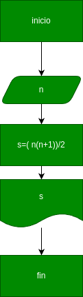

# Programa #1
Suma de los n primeros nùmeros naturales

# analisis
  ## imput
  ### variable de entrada
  **n**: valor a ingrsar
  ### processing 
  s =(n(n+1))/2
  ### output
  s
# diseño

# construccion
#input
n =input("digite el numero")

n =int(n)

#formula

s= (n*(n+1))/2

#output

print("la suma es" ,str (s))
